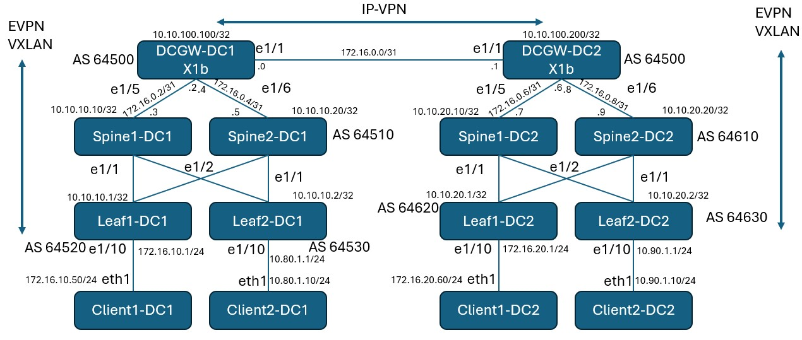

# EVPN-IPVPN interworking on SRL

This DCI lab shows EVPN-VXLAN and IPVPN-MPLS interworking on 7250 IXR-X1b running SR Linux.

## Topology


Client1 and Client2 on either DCs are connected over this infrastructure.

## Underlay
BGP is used as underlay protocol.
Leafs and Spines establish BGP sessions using IPv6 LLA.

## Overlay
All leaves establish BGP session with their DCGW and advertise EVPN address family.

## EVPN-IPVPN

On DCGW, a separate dual BGP instance IP-VPN is created for each EVPN service.

Example config for Client1 communication:

```srl
set / network-instance ip-vrf-2 type ip-vrf
set / network-instance ip-vrf-2 admin-state enable
set / network-instance ip-vrf-2 vxlan-interface vxlan13.100
set / network-instance ip-vrf-2 protocols bgp-evpn bgp-instance 2 encapsulation-type vxlan
set / network-instance ip-vrf-2 protocols bgp-evpn bgp-instance 2 vxlan-interface vxlan13.100
set / network-instance ip-vrf-2 protocols bgp-evpn bgp-instance 2 evi 100
set / network-instance ip-vrf-2 protocols bgp-ipvpn bgp-instance 1 mpls next-hop-resolution allowed-tunnel-types [ ldp ]
set / network-instance ip-vrf-2 protocols bgp-vpn bgp-instance 1 route-distinguisher rd 64500:100
set / network-instance ip-vrf-2 protocols bgp-vpn bgp-instance 1 route-target export-rt target:64500:100
set / network-instance ip-vrf-2 protocols bgp-vpn bgp-instance 1 route-target import-rt target:64500:100
set / network-instance ip-vrf-2 protocols bgp-vpn bgp-instance 2 route-distinguisher rd 10.10.10.1:100
set / network-instance ip-vrf-2 protocols bgp-vpn bgp-instance 2 route-target export-rt target:64520:100
set / network-instance ip-vrf-2 protocols bgp-vpn bgp-instance 2 route-target import-rt target:64520:100
```

On DCGW, IP-VPN route table shows entries for both client1 prefixes.

```srl
# show network-instance ip-vrf-2 route-table
---------------------------------------------------------------------------------------------------------------------------------------
IPv4 unicast route table of network instance ip-vrf-2
---------------------------------------------------------------------------------------------------------------------------------------
+----------+----------+----------+----------+----------+----------+----------+----------+----------+----------+----------+----------+
|  Prefix  |    ID    |  Route   |  Route   |  Active  |  Origin  |  Metric  |   Pref   | Next-hop | Next-hop |  Backup  |  Backup  |
|          |          |   Type   |  Owner   |          | Network  |          |          |  (Type)  | Interfac | Next-hop | Next-hop |
|          |          |          |          |          | Instance |          |          |          |    e     |  (Type)  | Interfac |
|          |          |          |          |          |          |          |          |          |          |          |    e     |
+==========+==========+==========+==========+==========+==========+==========+==========+==========+==========+==========+==========+
| 172.16.1 | 0        | bgp-evpn | bgp_evpn | True     | ip-vrf-2 | 0        | 170      | 10.10.10 |          |          |          |
| 0.0/24   |          |          | _mgr     |          |          |          |          | .1/32 (i |          |          |          |
|          |          |          |          |          |          |          |          | ndirect/ |          |          |          |
|          |          |          |          |          |          |          |          | vxlan)   |          |          |          |
| 172.16.2 | 0        | bgp-     | bgp_ipvp | True     | ip-vrf-2 | 4        | 170      | 10.10.10 |          |          |          |
| 0.0/24   |          | ipvpn    | n_mgr    |          |          |          |          | 0.200/32 |          |          |          |
|          |          |          |          |          |          |          |          | (indirec |          |          |          |
|          |          |          |          |          |          |          |          | t/ldp)   |          |          |          |
+----------+----------+----------+----------+----------+----------+----------+----------+----------+----------+----------+----------+
---------------------------------------------------------------------------------------------------------------------------------------
IPv4 routes total                    : 2
IPv4 prefixes with active routes     : 2
IPv4 prefixes with active ECMP routes: 0
---------------------------------------------------------------------------------------------------------------------------------------
```

## Ping between clients

Between Client1 in either DCs:

```srl
$ docker exec -it client1-dc1 bash

[x]─[client1-dc1]─[/]
└──> ping -c 1 172.16.20.60
PING 172.16.20.60 (172.16.20.60) 56(84) bytes of data.
64 bytes from 172.16.20.60: icmp_seq=1 ttl=253 time=3.06 ms

--- 172.16.20.60 ping statistics ---
1 packets transmitted, 1 received, 0% packet loss, time 0ms
rtt min/avg/max/mdev = 3.061/3.061/3.061/0.000 ms
```


