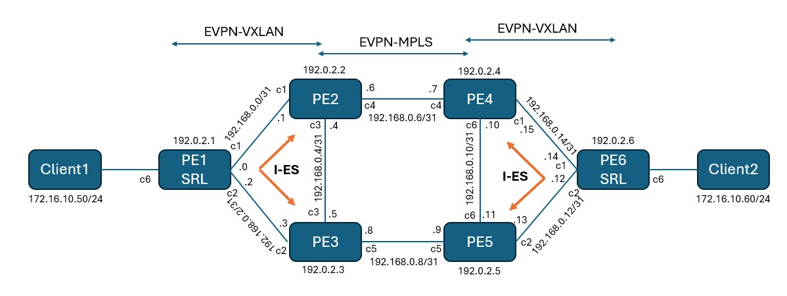

# DCGW Dual-homing with Interconnect Ethernet Segment (I-ES)

This DCI lab shows DCGW dual homing using I-ES. Each VXLAN domain with SR Linux as PE is dual-homed to 2 DCGWs running SROS.

EVPN-VXLAN to EVPN-MPLS interworking is configured on the DCGW.

## Topology

